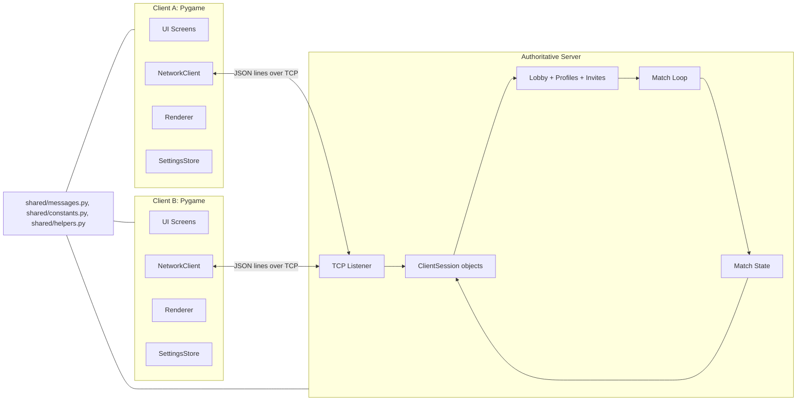
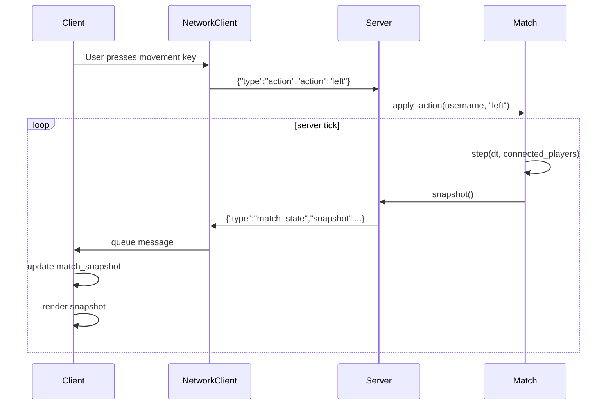
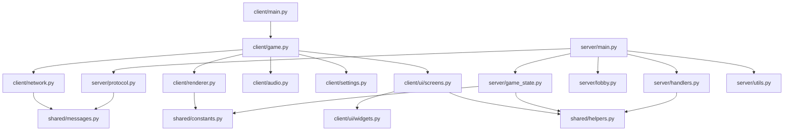
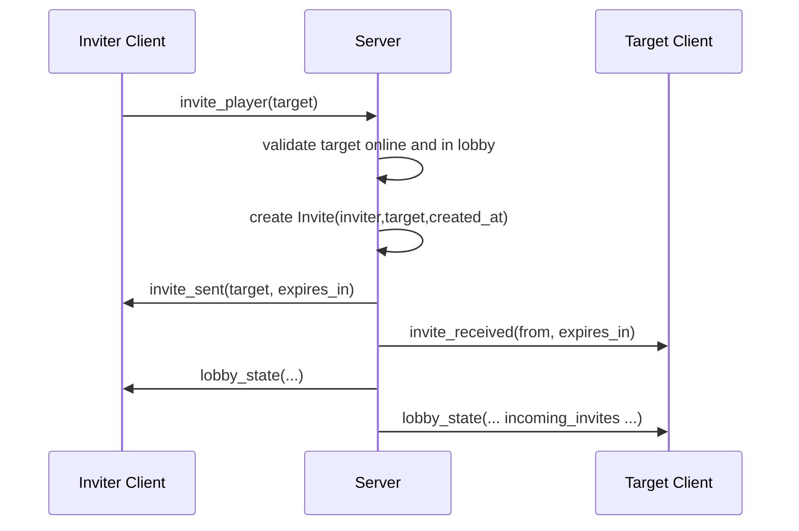
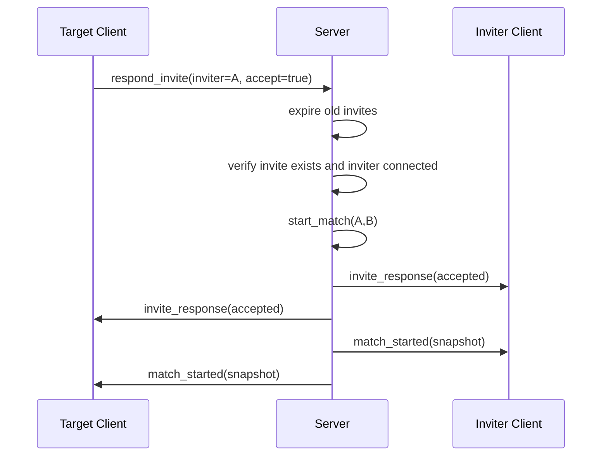
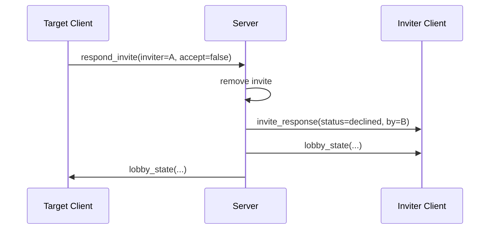
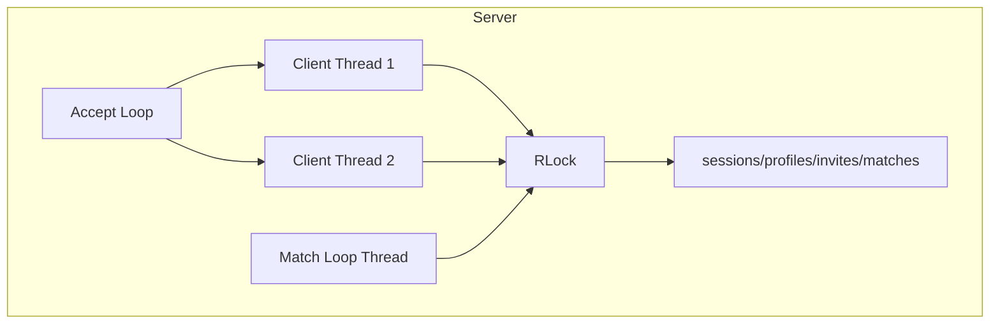
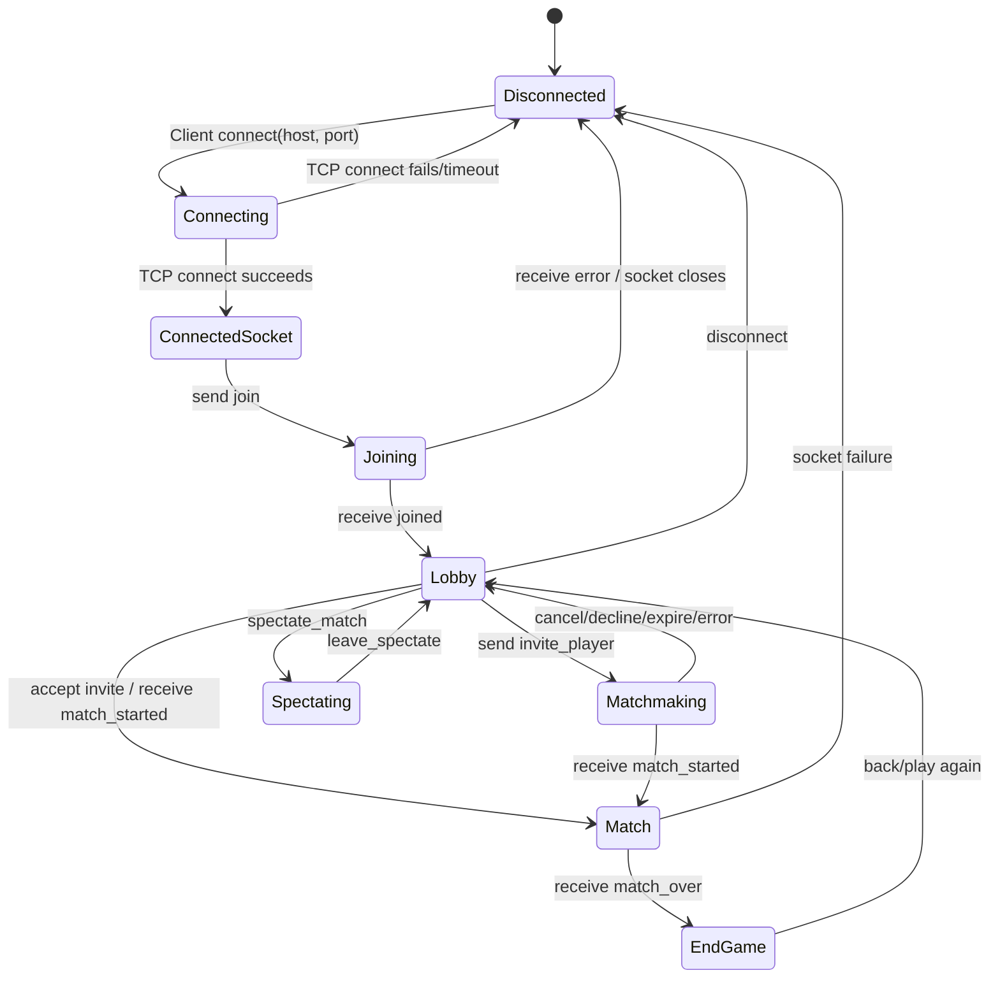

# Pithon Arena: Technical Software Engineering Report

## 1. Executive Summary

Pithon Arena is a two-player, real-time multiplayer snake battle game implemented in Python using Pygame for the graphical client and TCP sockets for networking. The project is organized as a client-server system with shared protocol utilities and constants. The game combines classic grid-based snake movement with multiplayer combat mechanics such as health points, scoring, map obstacles, collectible pies, powerups, lobby chat, match chat, invitations, spectating, and pause handling.

The game idea is a competitive arena duel: two players connect to a central server, configure their snake and match settings, invite each other from a lobby, and then compete on a selected map. The server owns the live game state and broadcasts snapshots to clients. Clients render the game, collect user input, and send high-level commands such as direction changes, chat messages, invitation responses, and pause requests.

The main objective of the project is to demonstrate network programming through a responsive multiplayer game. A multiplayer architecture was chosen because it directly exercises socket communication, message protocols, concurrency, synchronization, state ownership, and failure handling. These are core concepts in a computer networks project and are more visible in a real-time game than in a simple request-response application.

Major implemented features include:

| Area | Implemented Features |
|---|---|
| Networking | TCP client-server communication, JSON-line message framing, threaded client handling, message queues, socket timeouts |
| Lobby | Username registration, online user list, lobby refresh, lobby chat, active match list |
| Matchmaking | Player invitations, invitation cancellation, accept/decline flow, invitation expiration |
| Gameplay | Two-player snake movement, obstacles, pies, HP, score, powerups, timer, pause/resume, forfeit, leave-match handling |
| Spectating | Active match list and spectator snapshots |
| UI | Splash, menu, connection, lobby, customization, match settings, matchmaking, gameplay, spectator, settings, help, credits, endgame |
| Media | Background images, icons, generated map backgrounds/previews, lobby and battle music support |

Technical highlights:

- Authoritative server-side match state in `server/game_state.py`.
- Threaded TCP server in `server/main.py`.
- Threaded TCP client receiver and queue-based message handoff in `client/network.py`.
- Shared JSON-line protocol utilities in `shared/messages.py`.
- Modular Pygame UI screens in `client/ui/screens.py`.
- Server-controlled collision, health, scoring, powerups, timer, and winner logic.

Screenshot references available in the repository:


## 2. Problem Definition

The project aimed to build a playable networked game that demonstrates real-time multiplayer communication. The problem is not only to render a game locally, but to keep two different clients synchronized while allowing both players to interact with the same game world.

The multiplayer requirements are:

- Multiple clients must connect to one central server.
- Each client must register a unique username before sending gameplay commands.
- The lobby must show online users and active matches.
- A player must be able to invite another available player.
- The invited player must be able to accept or decline.
- Once accepted, both clients must receive the same starting game snapshot.
- During gameplay, both clients must see a consistent match state.
- Spectators must be able to observe live match snapshots.

Real-time responsiveness requirements:

- Player inputs must be transmitted quickly enough for a grid-based action game.
- The server must tick the match regularly.
- Clients must render at an interactive frame rate.
- Network receiving must not block the Pygame render loop.

Synchronization requirements:

- Both clients must agree on snake positions, HP, score, pies, powerups, obstacles, map, timer, and winner.
- Clients must not independently simulate authoritative positions.
- The same match snapshot must be sent to all players and spectators.
- Game-ending events must be broadcast consistently.

Fairness and game-state consistency are addressed by server authority. Clients send commands, not positions. For example, a client sends:

```json
{"type":"action","action":"up"}
```

The server decides whether the direction change is legal, advances the snake, resolves collisions, updates HP/score, and broadcasts:

```json
{"type":"match_state","snapshot":{ "...": "authoritative state" }}
```

This model reduces cheating opportunities compared with trusting each client to report its own position.

## 3. System Architecture

### Overall Architecture

The project follows a centralized client-server architecture:

- The server listens on a TCP port and accepts client connections.
- Each client runs a Pygame application and opens one TCP socket to the server.
- The server stores lobby state, profiles, invitations, active matches, spectators, and match state.
- The client stores UI state, local settings, the latest server snapshot, and outgoing user actions.
- Shared modules define constants, helper functions, and message framing.



### Server Responsibilities

Implemented mainly in `server/main.py`, `server/handlers.py`, `server/lobby.py`, `server/protocol.py`, and `server/game_state.py`.

| Responsibility | Implementation |
|---|---|
| Listen for clients | `ArenaServer.start()` binds, listens, accepts sockets |
| Manage sessions | `ClientSession` stores socket, username, reader, and send lock |
| Register usernames | `register_session()` validates uniqueness |
| Store profiles | `self.profiles` stores profile, controls, UI settings, status |
| Maintain lobby | `send_lobby_state()` broadcasts online users and active matches |
| Manage invitations | `send_invite()`, `cancel_invite()`, `respond_invite()` |
| Start matches | `start_match()` creates a `Match` object |
| Own gameplay state | `Match` stores snakes, HP, scores, pies, powerups, timer |
| Process inputs | `apply_action()` changes pending direction server-side |
| Broadcast snapshots | `match_loop()` sends `match_state` packets |
| Handle disconnects | `remove_session()` and `Match.step()` mark opponent winner |

### Client Responsibilities

Implemented mainly in `client/game.py`, `client/network.py`, `client/renderer.py`, `client/ui/screens.py`, `client/audio.py`, and `client/settings.py`.

| Responsibility | Implementation |
|---|---|
| Render UI | Screen classes in `client/ui/screens.py` |
| Render gameplay | `ArenaRenderer.draw_game()` |
| Connect to server | `NetworkClient.connect()` |
| Receive packets without blocking UI | Receiver thread and queue in `NetworkClient` |
| Send commands | `NetworkClient.send()` |
| Store latest match state | `GameClientApp.match_snapshot` |
| Persist local settings | `.client_settings.json` through `SettingsStore` |
| Play music | `SoundManager` |

### Shared Modules

| File | Purpose |
|---|---|
| `shared/messages.py` | JSON serialization, newline framing, message reader, socket send/recv helpers |
| `shared/constants.py` | Screen size, grid size, tick rates, default settings, maps, powerup types |
| `shared/helpers.py` | Username validation, time helper, clamp helpers, clock formatting |

### Data Flow



### Game State Ownership and Authority Model

The server is authoritative for gameplay. The implemented model is:

- Client sends user intent only.
- Server validates direction changes.
- Server advances snakes.
- Server resolves collisions.
- Server controls pie and powerup spawning.
- Server updates health and scores.
- Server determines when a match is over.
- Server sends snapshots to all players and spectators.

The client does not send snake coordinates, health, score, powerup state, or collision results. This prevents each client from unilaterally changing the match result.

### Modular Code Structure

```text
Final_Version/
|-- client/
|   |-- main.py              # Client entry point
|   |-- game.py              # Pygame app controller and message handling
|   |-- network.py           # Threaded TCP client
|   |-- renderer.py          # Game board and HUD rendering
|   |-- audio.py             # Music playback helper
|   |-- settings.py          # JSON-backed client settings
|   `-- ui/
|       |-- screens.py       # Screen classes
|       |-- widgets.py       # Reusable controls
|       |-- theme.py         # Colors and fonts
|       `-- assets_loader.py # Image and generated map assets
|-- server/
|   |-- main.py              # Server entry point and main state coordinator
|   |-- game_state.py        # Authoritative Match class
|   |-- handlers.py          # Message dispatcher
|   |-- lobby.py             # Profiles and invite helper structures
|   |-- protocol.py          # ClientSession wrapper
|   `-- utils.py             # Server utilities
|-- shared/
|   |-- messages.py          # JSON-line framing
|   |-- constants.py         # Game constants and defaults
|   `-- helpers.py           # Validation and formatting helpers
|-- assets/
|-- docs/
|-- README.md
`-- requirements.txt
```

### Dependency Diagram



## 4. Networking Design

### Socket Programming Used

The networking layer uses Python standard-library sockets:

- Server socket: `socket.socket(socket.AF_INET, socket.SOCK_STREAM)`
- Client socket: `socket.socket(socket.AF_INET, socket.SOCK_STREAM)`
- Transport: TCP
- Payload encoding: UTF-8 JSON
- Message framing: one JSON object per line

Relevant implementation points:

- `server/main.py`: creates, binds, listens, accepts, and receives from sockets.
- `server/protocol.py`: wraps client sessions and serializes sends with a lock.
- `client/network.py`: connects to the server, receives on a background thread, and queues messages.
- `shared/messages.py`: implements JSON-line encoding/decoding.

### TCP vs UDP Choice

The project uses TCP, not UDP. This is visible through `socket.SOCK_STREAM` on both server and client.

TCP is appropriate for this implementation because:

- Message ordering is guaranteed.
- Lost packets are retransmitted automatically.
- The JSON-line protocol depends on ordered byte streams.
- Lobby, invitation, chat, and match-start messages must arrive reliably.
- The game is grid-based rather than ultra-high-frequency physics simulation, so TCP reliability is acceptable.

Tradeoff:

- TCP can introduce latency during packet loss because it preserves ordering and retransmits lost data.
- A UDP design could reduce latency for high-frequency snapshots, but it would require custom reliability, sequencing, and loss handling. That complexity was not implemented.

### Host and Port Configuration

The server defaults to:

```python
host = "0.0.0.0"
port = 5050
```

This means the server listens on all local network interfaces on port `5050`. The client settings default to:

```json
{
  "host": "127.0.0.1",
  "port": 5050
}
```

For local testing on one machine, both clients can connect to `127.0.0.1:5050`. For LAN testing, clients should connect to the server machine's LAN IP address.

### `bind()`

The server calls:

```python
self.server_socket.bind((self.host, self.port))
```

This reserves the configured address and port so the operating system can route incoming TCP connections to the game server.

### `listen()`

The server calls:

```python
self.server_socket.listen()
```

This places the socket into listening mode. The code does not specify a custom backlog, so Python/OS defaults are used.

### `accept()`

The server repeatedly calls:

```python
client_socket, address = self.server_socket.accept()
```

Each accepted client socket is wrapped in a `ClientSession`, assigned a short timeout, and handled by a new daemon thread.

### `connect()`

The client calls:

```python
sock.connect((host, port))
```

The client first uses a 5-second timeout while connecting, then changes to a 0.1-second timeout for non-blocking-style polling in the receiver thread.

### `send()` / `recv()`

Sending uses `sendall()` through `shared.messages.send_message()`. This is important because a single `send()` call is not guaranteed to send the full byte buffer.

Receiving uses:

```python
sock.recv(4096)
```

Received chunks are fed into `MessageReader`, which buffers incomplete lines and returns only complete JSON messages.

### Packet Framing and Message Format

The protocol is newline-delimited JSON:

```python
json.dumps(payload, separators=(",", ":")) + "\n"
```

Every packet is a JSON object with a `type` field.

Example serialized packet:

```text
{"type":"join","username":"player_one"}\n
```

Framing is handled by `MessageReader.feed()`:

1. Decode incoming bytes as UTF-8.
2. Append to an internal string buffer.
3. Split complete messages at `\n`.
4. Ignore blank lines.
5. Parse each complete line with `json.loads()`.
6. Keep any incomplete trailing data in the buffer.

This solves the TCP stream problem where one `recv()` may contain a partial message, exactly one message, or multiple messages.

### Serialization and Deserialization

| Direction | Operation | Implementation |
|---|---|---|
| Python dict to wire | `json.dumps()` + newline + UTF-8 encode | `send_message()` |
| Wire to Python dict | UTF-8 decode + newline split + `json.loads()` | `MessageReader.feed()` |

No binary protocol, compression, encryption, or schema validation library is used.

### Message Protocol

Client-to-server messages implemented in `server/handlers.py`:

| Type | Purpose |
|---|---|
| `join` | Register username |
| `save_profile` | Save snake, controls, UI, and match settings |
| `request_lobby` | Request lobby snapshot |
| `send_lobby_chat` | Broadcast lobby chat |
| `invite_player` | Invite another lobby user |
| `cancel_invite` | Cancel pending invite |
| `respond_invite` | Accept or decline invite |
| `spectate_match` | Join active match as spectator |
| `leave_spectate` | Leave spectator mode |
| `action` | Send movement command |
| `send_match_chat` | Broadcast match chat |
| `emoji_reaction` | Send in-match reaction |
| `forfeit_match` | Forfeit current match |
| `leave_match` | Leave current match |
| `request_pause` | Request server-side pause |
| `resume_pause` | Resume paused match |

Server-to-client messages handled in `client/game.py`:

| Type | Purpose |
|---|---|
| `joined` | Confirms username registration |
| `error` | Reports protocol or gameplay error |
| `connection_closed` | Local synthetic client event when socket closes/fails |
| `lobby_state` | Users, active matches, chat history, incoming invites |
| `lobby_chat` | New lobby chat line |
| `invite_sent` | Confirms invite sent |
| `invite_received` | Notifies target of invite |
| `invite_cancelled` | Notifies invite cancellation |
| `invite_expired` | Notifies sender/receiver of expiration |
| `invite_response` | Accepted or declined invite |
| `match_started` | Initial authoritative match snapshot |
| `spectate_started` | Initial spectator snapshot |
| `match_state` | Periodic authoritative match snapshot |
| `match_chat` | New match chat line |
| `reaction` | New emoji reaction |
| `match_over` | Match result and final snapshot |

Unsupported private chat aliases are explicitly rejected with `Private lobby chat is disabled.`

### Matchmaking Communication



### Lobby Communication

Lobby state is requested manually and also periodically by the lobby UI once per second. The server responds with:

- online users
- lobby messages
- active matches
- per-user incoming invites

Lobby chat is broadcast immediately to all connected sessions through `send_lobby_chat()`.

### Invitation Handling

Invitations are represented by the `Invite` dataclass:

```python
Invite(inviter: str, target: str, created_at: float)
```

The expiration time is controlled by `INVITE_TTL_SECONDS = 30`. Expiration is checked during lobby state sends, invite responses, and the server match loop.

Accept flow:



Decline flow:



### Game-Start Synchronization

When an invitation is accepted, `start_match()` creates a server-side `Match` object and immediately sends the same initial snapshot to both players.

The initial snapshot contains:

- match ID
- player names
- map name
- map palette
- obstacles
- pies
- powerups
- snake segment coordinates
- scores
- health
- alive status
- time remaining
- target score value
- announcements
- snake colors
- buffs
- pause state

Both clients start the gameplay screen from this snapshot.

### In-Game State Synchronization

The server match loop runs at `TICK_RATE = 15` ticks per second. On each loop iteration:

1. Expired invites are removed.
2. Each active match is stepped using `match.step(interval, connected)`.
3. A full snapshot is generated.
4. The snapshot is sent to each player and spectator as a `match_state` message.
5. Finished matches are completed and removed.

Although `STATE_BROADCAST_RATE = 10` exists in `shared/constants.py`, the current implementation broadcasts a snapshot every match-loop tick rather than using that constant as a separate broadcast limiter.

### Heartbeat / Keepalive

No explicit heartbeat or keepalive packet is implemented. The server detects disconnects when:

- `recv()` returns `b""` in the client thread.
- a socket operation raises `OSError`.
- the match loop sees a player absent from the active session set.

TCP itself may detect broken connections eventually, but the application does not send periodic heartbeat messages such as `ping`/`pong`.

### Disconnect Handling

Server-side disconnect handling:

- `client_loop()` exits when `recv()` returns empty bytes or raises an OS error.
- `remove_session()` removes the username from active sessions.
- pending invites involving that username are removed.
- spectator state is cleared.
- profile status is set to offline.
- if the player was in a match, `forfeit_match(..., disconnected=True)` marks the opponent as winner.

Client-side disconnect handling:

- Send failure generates local `connection_closed` with reason `send_failed`.
- Receive closure generates `connection_closed` with reason `server_disconnected`.
- Receive error generates `connection_closed` with reason `recv_failed`.
- The client returns to the menu when a connection closes.

### Reconnect Handling

No match reconnection system is implemented. A user can reconnect with a username only after the previous session is gone, but the implementation does not restore an in-progress match to a returning player. A disconnect during a match is treated as a loss/forfeit.

### Timeout Handling

Implemented timeout behavior:

- Client connection attempt timeout: 5 seconds.
- Client receive polling timeout: 0.1 seconds.
- Server per-client socket timeout: 0.1 seconds.
- Invitation TTL: 30 seconds.
- Pause timeout: 30 seconds.

No global idle-session timeout is implemented.

### Error Handling

Implemented error cases include:

- Invalid username.
- Username already in use.
- Command sent before joining.
- Inviting yourself.
- Target offline.
- Target busy.
- Invite not found.
- Invite expired.
- Inviter disconnected.
- Private lobby chat disabled.
- Match not found for spectating.
- Socket send/receive failures.

### Latency Considerations

The design is suitable for LAN and small-scale internet testing because:

- Messages are compact JSON objects.
- Clients send only user commands, not full local state.
- Server snapshots are full state snapshots, simplifying synchronization.
- Pygame rendering runs independently of socket receiving.

Latency limitations:

- TCP retransmission can delay later packets if one packet is lost.
- Full snapshots are sent every server tick, which is simple but not bandwidth-optimal.
- There is no client interpolation or prediction, so visual smoothness depends on snapshot arrival and render timing.

### Packet Ordering

TCP provides ordered delivery. The game relies on this property for lobby transitions, invite handling, match start, and sequential snapshots.

### Concurrency and Threading Model

Server:

- Main thread accepts sockets.
- One daemon thread handles each connected client.
- One daemon match-loop thread updates all active matches.
- A shared `threading.RLock` protects shared server state.
- Each `ClientSession` has a send lock to avoid interleaved writes from multiple threads.

Client:

- Main Pygame loop handles rendering and input.
- One daemon receiver thread reads from the socket.
- A `queue.Queue` passes received messages from the receiver thread to the Pygame loop.
- A send lock serializes outgoing writes.



### Race-Condition Prevention

The server wraps shared state operations in `with self.lock:`. This protects:

- session registration/removal
- invite creation/removal/expiration
- profile updates
- match creation/completion
- spectator lookup
- gameplay command application
- pause/resume and forfeit/leave handling

Per-session sends also use `ClientSession.send_lock`, preventing two server threads from writing partial JSON lines to the same socket at the same time.

### Scalability Limitations

The implementation is appropriate for a course project and small multiplayer sessions, but it has limits:

- One thread per client does not scale as efficiently as async I/O for many users.
- Every active match is updated in one shared match loop.
- Full snapshots are broadcast frequently.
- There is no room sharding or server clustering.
- User profiles are in memory, not persisted in a database.
- There is no authentication or account system.
- There is no reconnect/resume logic.

### LAN vs Internet Play

LAN play:

- Start server on one machine.
- Other clients connect to the server machine's local IP address and port `5050`.
- Usually works if the host firewall allows incoming TCP connections.

Internet play:

- Clients outside the host network cannot usually connect directly to a private LAN IP.
- The host may need port forwarding on the router.
- Firewalls may block inbound traffic.
- Public IP addresses can change.

### NAT Issue Explanation

Most home and campus networks use NAT. A server running on a laptop may have a private address such as `192.168.x.x` or `10.x.x.x`. Devices outside that local network cannot directly route packets to that private address. The router must forward public traffic on a chosen port to the internal server machine. Without port forwarding, external clients cannot reach the server.

### Why VPN/Tailscale Can Help

A mesh VPN such as Tailscale gives devices private overlay-network addresses that can reach each other even when they are behind NAT. In this project, Tailscale can simplify testing by letting clients connect to the server using its Tailscale IP instead of configuring router port forwarding.

### Deployment Considerations

For a more production-like deployment:

- Run `python -m server.main` on a cloud VM.
- Open TCP port `5050` in the VM firewall/security group.
- Configure clients to connect to the VM public IP.
- Add logging rotation and monitoring.
- Add authentication if public access is allowed.
- Add TLS or an encrypted transport if sensitive data is introduced.
- Add rate limits to avoid spam or abuse.

### Security Concerns

Current trust model:

- The server trusts that usernames are not identities.
- There is no password authentication.
- There is no message authentication or encryption.
- Chat text is trimmed but not deeply sanitized.
- Clients can send rapid commands or spam chat unless rate limiting is added.

Anti-cheat strengths:

- Clients cannot directly set position, score, HP, pies, or winner.
- Server validates direction reversal and collisions.
- Server owns all match-ending decisions.

Remaining security limitations:

- A modified client can spam commands.
- A modified client can send malformed message types.
- There is no replay validation or audit log.
- There is no cryptographic identity.

### Connection Lifecycle Diagram



### Packet Examples

Join:

```json
{"type":"join","username":"alice"}
```

Joined:

```json
{"type":"joined","username":"alice","profile":{"snake_color":"ember","snake_skin":"classic","map":"Desert","duration":2,"target_score":400,"visual_mod":"Classic Glow"},"controls":{"up":"w","down":"s","left":"a","right":"d"}}
```

Lobby request:

```json
{"type":"request_lobby"}
```

Lobby state:

```json
{
  "type": "lobby_state",
  "users": [{"username": "alice", "status": "lobby", "map": "Desert"}],
  "messages": ["alice: hello"],
  "active_matches": [],
  "incoming_invites": []
}
```

Invite:

```json
{"type":"invite_player","target":"bob"}
```

Accept invite:

```json
{"type":"respond_invite","inviter":"alice","accept":true}
```

Movement command:

```json
{"type":"action","action":"right"}
```

Snapshot:

```json
{
  "type": "match_state",
  "snapshot": {
    "match_id": "alice_vs_bob_1713550000",
    "players": ["alice", "bob"],
    "map": "Desert",
    "snakes": {"alice": [[5,12],[4,12],[3,12]], "bob": [[30,12],[31,12],[32,12]]},
    "scores": {"alice": 10, "bob": 0},
    "health": {"alice": 100, "bob": 86},
    "time_left": 116.4
  }
}
```

Match over:

```json
{"type":"match_over","winner":"alice","scores":{"alice":34,"bob":18},"reason":"player_left","left_by":"bob","snapshot":{}}
```

## 5. Multiplayer Logic

### Room Creation

There is no separate room class. A match acts as a room. When an invite is accepted, `start_match()` creates:

```python
match_id = f"{player_a}_vs_{player_b}_{int(time.time())}"
match = Match(match_id=match_id, players=[player_a, player_b], profiles=self.profiles)
```

The match is stored in:

```python
self.active_matches[match_id] = match
```

### Lobby Management

The lobby is maintained using:

- `self.sessions`: currently connected users.
- `self.profiles`: per-user profile and status.
- `self.lobby_messages`: recent lobby chat lines.
- `self.active_matches`: match list visible to spectators.
- `self.invites`: pending invitations by target username.

`send_lobby_state()` sends each connected user a tailored lobby state including only that user's incoming invites.

### Player Registration

Players register with `join`. Usernames are validated using:

- minimum length: 3
- maximum length: 12
- allowed characters: letters, numbers, underscore

Duplicate usernames are rejected while the original session is active.

### Invitation System

The invitation system supports:

- sending an invite
- replacing a previous invite from the same inviter to the same target
- notifying sender and receiver
- cancellation
- accept/decline
- expiration after 30 seconds

The lobby UI shows incoming invite text and accepts `Y` or `N` in the lobby.

### Ready State

No separate ready-state system is implemented. Accepting an invite immediately starts the match.

### Countdown Synchronization

No pre-match countdown is implemented. Both clients receive `match_started` with the same snapshot and transition to gameplay.

### Authoritative Scoring

Scores are stored and changed only inside the server-side `Match` object:

- collecting a pie: `+10`
- collecting a powerup: `+8`
- drain powerup: additional `+5`
- collision: `-6`, clamped at zero

Clients only display scores from snapshots.

### Collision Synchronization

Collision resolution is server-side. The server checks:

- wall collisions
- self collisions
- collision with opponent body
- obstacle collisions
- powerup shield absorption

The resulting HP, score, alive status, and announcements are broadcast in the next snapshot.

### HP Synchronization

HP is stored in `self.health`. It starts at `100` for each player. HP changes are:

- pie collection: heal `+6`, max `100`
- wall collision: damage `14`
- self collision: damage `16`
- opponent snake collision: damage `18`
- obstacle collision: damage `12`
- drain powerup: opponent damage `18`

When HP reaches zero, the affected player is marked not alive and the opponent wins.

### Timer Synchronization

The match timer is server-side. The inviter's saved profile duration is converted from minutes to seconds:

```python
self.time_left = duration * 60.0
```

The server decrements it in `Match.step()`. Clients render `time_left` from snapshots.

### Win-Condition Logic

Implemented match-ending conditions:

- one player eliminated by HP reaching zero
- both players eliminated, winner chosen by higher score
- timer reaches zero, winner chosen by higher score among alive players
- player disconnects, opponent wins
- player forfeits, opponent wins
- player leaves match, opponent wins

Important implementation note: although `target_score` is stored, shown in the UI, and included in snapshots, the current server-side `Match.step()` does not check `score >= target_score` as a win condition. Therefore, the implemented winner logic is timer/elimination/disconnect/forfeit/leave based, not first-to-target-score based.

### Leave-Match Handling

`leave_match` sets:

- `match.over = True`
- `match.winner = opponent`
- `match.end_reason = "player_left"`
- `match.left_player = username`

The player who left is returned to the lobby, while the opponent/spectators receive a match-over result.

### State Reset After Game

When a match completes:

- The match is removed from `active_matches`.
- Players' profile statuses return to `lobby`.
- Their `current_match` fields are cleared.
- Spectators are returned to lobby.
- Spectator lookup entries are removed.
- A new lobby state is broadcast.

## 6. Game Logic

### Movement

The game uses a fixed grid:

- width: 36 cells
- height: 24 cells

Each player has:

- a list of snake segment coordinates
- current direction
- pending direction
- move timer

Players send movement commands. The server prevents immediate reversal by rejecting a proposed direction if it is the opposite of the current direction.

Movement speed:

- normal interval: `0.18` seconds per move
- boost interval: `0.14` seconds per move

### Collision

The server checks the new head position before inserting it. If the move is invalid, damage is applied and the snake does not advance into the blocked cell.

Collision cases:

| Collision | Effect |
|---|---|
| Wall | 14 damage, -6 score |
| Self | 16 damage, -6 score |
| Opponent snake | 18 damage, -6 score unless shielded |
| Obstacle | 12 damage, -6 score unless shielded |

### Scoring

Implemented scoring:

| Event | Score Change |
|---|---|
| Pie collected | `+10` |
| Powerup collected | `+8` |
| Drain powerup | additional `+5` |
| Collision | `-6`, minimum score 0 |

### HP

Each player starts with `100` HP. HP is displayed in the HUD. If HP reaches zero, the player is eliminated.

### Powerups

Powerups are called Arena Blessings in the UI. Implemented types:

| Powerup | Server Effect |
|---|---|
| `shield` | Protects from one opponent/obstacle crash for 8 seconds or until used |
| `boost` | Reduces movement interval for 6 seconds |
| `drain` | Damages opponent by 18 HP and awards extra score |

Powerups spawn server-side every 8 seconds if fewer than 2 are active.

### Obstacles

Obstacles are map-specific fixed cell coordinates defined in `shared/constants.py`. They are included in snapshots so every client renders the same arena.

### Map Selection

Implemented maps:

- Desert
- Snow
- Jungle

The inviter's saved profile is the authoritative source for the match map. Maps define:

- background key
- field/grid/obstacle/pie/panel colors
- obstacle coordinates

### Round Flow

1. Player connects and joins lobby.
2. Player configures profile and match settings.
3. Player invites an available opponent.
4. Opponent accepts.
5. Server creates match.
6. Server sends initial snapshot to both clients.
7. Players send actions and receive snapshots.
8. Match ends by elimination, timer, disconnect, forfeit, or leave.
9. Server returns participants to lobby.

### Winner Determination

Winner is determined server-side. The implemented logic chooses:

- opponent of eliminated/disconnected/forfeiting/leaving player
- remaining alive player if only one is alive
- highest score if time expires
- highest score if both become not alive

### Balancing Logic

Balancing values are centralized in code:

- identical starting HP
- symmetric starting snake positions
- equal initial snake length
- reverse starting directions
- fixed map obstacles
- score penalties for crashes
- limited shield/boost durations
- maximum 2 active powerups
- pause limit of 3 per player

## 7. UI / UX

The client is organized into screen classes, each responsible for event handling, updates, and drawing.

| Screen | Purpose |
|---|---|
| `SplashScreen` | Intro screen and project branding |
| `MainMenuScreen` | Play, settings, help, exit |
| `ConnectionScreen` | Server IP, port, username validation |
| `LobbyScreen` | Online users, active matches, chat, invite/spectate buttons |
| `CustomizationScreen` | Snake color, skin, control mapping |
| `MatchSettingsScreen` | Map, duration, target score, visual variation |
| `MatchmakingScreen` | Waiting state for sent invite |
| `GameScreen` | Gameplay, HUD, chat, pause/settings overlay |
| `SpectatorScreen` | View active match snapshots |
| `EndGameScreen` | Winner and scores |
| `SettingsScreen` | Music, SFX, brightness, UI scale, fullscreen, mute |
| `HelpScreen` | How-to-play instructions |
| `CreditsScreen` | Project credits placeholder |

HUD elements include:

- game title
- local pilot/spectator label
- timer
- target score display
- player cards
- HP bars
- scores
- distance/range indicator
- buff indicators
- pause count
- announcements feed
- match chat
- pause overlay

Notifications:

- connection messages
- invite status
- incoming invite prompt
- invite expiration
- match result messages
- audio errors if assets are missing or unsupported

Visual feedback:

- selected list rows
- hovered buttons
- HP bars
- shield outline around snake head
- powerup colors
- map-specific color palettes

Audio:

- `SoundManager` supports lobby and battle music from `assets/sounds/lobby_music.mp3` and `assets/sounds/battle_music.mp3`.
- Volume and mute are controlled through settings.
- Missing audio files are handled gracefully through status messages.

## 8. Data Structures and Classes

### `ArenaServer`

File: `server/main.py`

Central server coordinator.

Important state:

| Field | Purpose |
|---|---|
| `sessions` | username to `ClientSession` |
| `profiles` | username to profile/control/status data |
| `invites` | target username to list of `Invite` objects |
| `active_matches` | match ID to `Match` |
| `spectator_lookup` | spectator username to match ID |
| `lobby_messages` | recent lobby chat |
| `lock` | shared `RLock` |

Important methods:

- `start()`
- `client_loop()`
- `register_session()`
- `remove_session()`
- `send_lobby_state()`
- `send_invite()`
- `respond_invite()`
- `start_match()`
- `match_loop()`
- `_complete_match()`

### `ClientSession`

File: `server/protocol.py`

Wraps one connected client socket.

Fields:

- socket
- address
- username
- `MessageReader`
- alive flag
- send lock

Methods:

- `send(payload)`
- `close()`

### `Match`

File: `server/game_state.py`

Authoritative game state model.

Important state:

| Field | Purpose |
|---|---|
| `players` | two player usernames |
| `snakes` | username to list of grid cells |
| `directions` | current movement direction |
| `pending_directions` | next accepted direction |
| `health` | HP per player |
| `scores` | score per player |
| `alive` | alive status per player |
| `pies` | collectible score cells |
| `powerups` | active powerup cells and kinds |
| `buffs` | active shield/boost timers |
| `time_left` | authoritative round timer |
| `paused` | pause state |
| `pauses_left` | remaining pauses per player |
| `over` | match finished flag |
| `winner` | winner username |

Important methods:

- `__post_init__()`
- `apply_action()`
- `request_pause()`
- `resume_pause()`
- `step()`
- `snapshot()`
- `_advance_player()`
- `_apply_powerup()`
- `_apply_collision()`
- `_random_open_cell()`

### `NetworkClient`

File: `client/network.py`

Client-side socket wrapper.

Important state:

- socket
- reader
- incoming message queue
- receiver thread
- send lock
- connected/running flags

Important methods:

- `connect()`
- `disconnect()`
- `send()`
- `poll()`
- `_recv_loop()`

### `GameClientApp`

File: `client/game.py`

Main Pygame application controller.

Responsibilities:

- initialize Pygame, mixer, assets, renderer, network, settings
- maintain current screen
- run the frame loop
- process network messages
- transition screens
- store latest lobby and match state
- send profile/invite/lobby/gameplay commands

### UI Classes

File: `client/ui/screens.py`

Each screen subclasses `BaseScreen` and implements combinations of:

- `on_enter()`
- `handle_event()`
- `update()`
- `draw()`

Reusable widgets in `client/ui/widgets.py`:

- `Button`
- `InputField`
- `Slider`
- `Toggle`
- `ListBox`
- `draw_paragraph()`

### Asset and Theme Classes

| Class | File | Role |
|---|---|---|
| `AssetLoader` | `client/ui/assets_loader.py` | Loads images and generates map backgrounds/previews |
| `Theme` | `client/ui/theme.py` | Stores colors and fonts |
| `SoundManager` | `client/audio.py` | Plays lobby/battle music with fallback behavior |
| `SettingsStore` | `client/settings.py` | Reads/writes `.client_settings.json` |

## 9. Algorithms

### Collision Detection

The collision algorithm is grid-based:

1. Read current snake head.
2. Add direction vector to compute `new_head`.
3. Check out-of-bounds.
4. Check self-body collision.
5. Check opponent snake collision.
6. Check obstacle collision.
7. Insert new head.
8. Check pie collection.
9. Check powerup collection.
10. Pop tail if not growing.

This is efficient for a small grid. Most checks are membership tests over short lists. For larger grids or longer snakes, converting snake segments to sets could improve performance.

### Synchronization Logic

The synchronization algorithm is snapshot-based:

1. Client sends command.
2. Server applies command to authoritative state.
3. Server ticks all matches at fixed interval.
4. Server generates full snapshot.
5. Server sends snapshot to both players and spectators.
6. Clients replace local `match_snapshot`.
7. Renderer draws the latest snapshot.

No interpolation, client prediction, rollback, or delta compression is implemented.

### Matchmaking Algorithm

The matchmaking system is invitation-based, not automatic queue-based matchmaking:

1. Client selects a lobby user.
2. Server validates target availability.
3. Server stores invite with expiration timestamp.
4. Target accepts or rejects.
5. Accept creates a match.

There is no skill rating, random pairing, queue, or ranking system.

### Timing Systems

Timing is based on floating-point seconds:

- server match tick interval: `1 / TICK_RATE`
- snake move timers per player
- powerup spawn timer
- buff timers
- round timer
- pause countdown
- invite expiration based on `time.time()`

### Invitation Expiration

Each invite stores `created_at`. Remaining time is:

```python
INVITE_TTL_SECONDS - (now() - created_at)
```

The server removes expired invites during lobby updates, invite responses, and the match loop.

### Scoring Update Logic

Scoring is event-driven:

- Pie collection updates score and HP.
- Powerup pickup updates score and applies effect.
- Drain adds extra score and damages opponent.
- Collision subtracts score and HP.
- Timer-based winner selection compares current scores.

## 10. Assets and Media

### Image Assets

Repository image assets include:

| Path | Usage |
|---|---|
| `assets/backgrounds/arena_landscape.jpg` | background |
| `assets/backgrounds/arena_portrait.jpg` | menu/portrait background |
| `assets/images/snake_concept.jpg` | snake preview image |
| `assets/images/banner_strip.jpg` | banner asset |
| `assets/icons/badge_alpha.jpg` | player badge |
| `assets/icons/badge_beta.jpg` | player badge |
| `assets/icons/badge_gamma.jpg` | extra badge asset |
| `assets/icons/icon_orb.jpg` | icon asset |
| `assets/icons/icon_shield.jpg` | icon asset |

### Sound Assets

| Path | Usage |
|---|---|
| `assets/sounds/lobby_music.mp3` | lobby/menu music |
| `assets/sounds/battle_music.mp3` | gameplay/spectator music |

### Loading Pipeline

`AssetLoader.load()` loads images with `pygame.image.load(...).convert_alpha()`. Missing images return `None` rather than crashing. The renderer falls back to solid theme backgrounds when a background is missing.

Map backgrounds and previews are generated programmatically for Desert, Snow, and Jungle. This avoids requiring separate image files for every map and ensures each map has distinct visual presentation.

### Asset Management

Assets are stored in a dictionary on the client:

```python
self.assets = AssetLoader(self.root).load()
```

Screens and renderer access assets by keys such as:

- `background`
- `portrait`
- `snake`
- `badge_alpha`
- `badge_beta`
- `map_backgrounds`
- `map_previews`

## 11. Testing and Validation

### Validation Performed During Report Preparation

The codebase was compiled with:

```powershell
python -m compileall client server shared
```

Result: successful compilation of `client`, `client/ui`, `server`, and `shared`.

No automated unit test files are currently included in the repository.

### Proposed Test Plan

| Test Area | Test Case | Expected Result |
|---|---|---|
| Startup | Run `python -m server.main` | Server listens on `0.0.0.0:5050` |
| Client launch | Run `python -m client.main` | Pygame window opens |
| Connection | Connect to `127.0.0.1:5050` | Client receives `joined` and enters lobby |
| Username validation | Use invalid username | Client/server reject with error |
| Duplicate username | Two clients join same name | Second client receives error |
| Lobby refresh | Two clients connected | Each sees the other as available |
| Lobby chat | Send message | Message appears for all connected users |
| Invite | Client A invites Client B | A sees sent status, B sees incoming invite |
| Invite decline | B rejects | A receives declined response |
| Invite cancel | A cancels before response | B receives cancellation |
| Invite expiration | Wait 30 seconds | Both sides receive expiration |
| Match start | B accepts | Both receive same initial snapshot |
| Movement | Press movement keys | Server updates snake direction and broadcasts snapshots |
| Reverse prevention | Try immediate opposite direction | Server rejects reversal |
| Pie pickup | Snake head reaches pie | Score increases and snake grows |
| Wall collision | Move into boundary | HP decreases and score penalty applies |
| Obstacle collision | Hit obstacle | HP decreases unless shield active |
| Shield | Pick shield then hit obstacle/opponent | Shield absorbs one applicable hit |
| Boost | Pick boost | Snake move interval decreases temporarily |
| Drain | Pick drain | Opponent HP decreases and picker gains score |
| Timer | Let timer expire | Higher score wins |
| Forfeit | Send `forfeit_match` | Opponent wins |
| Leave match | Confirm leave | Leaver returns to lobby, opponent gets match over |
| Disconnect | Close one client mid-match | Opponent wins by disconnect |
| Spectate | Third client spectates match | Spectator receives live snapshots |
| Pause | Request pause | Match timer/movement pauses |
| Pause expiry | Wait 30 seconds | Match resumes automatically |
| Audio missing/unsupported | Remove or corrupt MP3 | UI reports audio error without crashing |

### Unit Tests to Add

Recommended unit tests:

- `MessageReader` handles partial messages.
- `MessageReader` handles multiple messages in one buffer.
- username validation accepts/rejects expected values.
- `clamp_target_score()` enforces range.
- `Invite.expires_in()` decreases and clamps to zero.
- `Match.apply_action()` rejects immediate reversal.
- `_random_open_cell()` avoids obstacles, snakes, pies, and powerups.
- `_apply_collision()` decreases HP and clamps score.
- `_apply_powerup()` applies shield, boost, and drain correctly.

### Integration Tests to Add

Recommended integration tests:

- server accepts two clients and registers usernames
- lobby state includes both connected users
- invite accept creates one active match
- action packet changes authoritative pending direction
- server sends `match_state` to both players
- disconnect produces `match_over`

### Multiplayer Tests

Manual multiplayer validation should include:

1. Same-machine two-client test using `127.0.0.1`.
2. LAN two-machine test using host LAN IP.
3. Three-client test with spectator.
4. Simultaneous movement inputs.
5. Chat and emoji messages during gameplay.
6. Client close during active match.

### Stress Tests

Recommended stress tests:

- 10+ lobby clients repeatedly requesting lobby state.
- Multiple active matches at the same time.
- Rapid movement key presses from both players.
- Repeated invite creation/cancellation.
- Chat spam to verify trimming and UI behavior.
- Long-running server session to monitor memory and thread count.

### Bug Cases Found / Implementation Gaps

| Finding | Status |
|---|---|
| `target_score` exists in profile/snapshot/UI but is not enforced as a win condition | Documented implementation gap |
| `STATE_BROADCAST_RATE` constant exists but snapshots are sent every match loop tick | Documented implementation gap |
| No heartbeat or reconnect system | Documented limitation |
| No automated tests included | Documented limitation |
| No separate ready/countdown phase | Documented limitation |

### Fixes Applied During Report Preparation

No code fixes were applied during report preparation. The report documents the implementation as it exists.

## 12. Challenges and Solutions

### Synchronization

Challenge: both players must see the same game state despite running separate clients.

Solution: the server owns the match state and broadcasts full snapshots. Clients do not simulate authoritative state.

### Concurrency

Challenge: multiple client threads and the match loop access shared state.

Solution: server state access is guarded by `threading.RLock`. Socket writes are guarded with per-session send locks.

### Disconnects

Challenge: a player can close the client during a match.

Solution: socket closure removes the session, clears lobby/spectator state, and marks the opponent as winner if the player was in a match.

### UI Overlap and State Transitions

Challenge: the Pygame client has many screens and network-driven transitions.

Solution: screen classes separate UI logic, and `GameClientApp._handle_message()` centralizes network-driven state transitions.

### State Consistency

Challenge: clients could otherwise disagree about collisions, HP, score, or winner.

Solution: clients only render snapshots; server-side `Match` handles collision and score changes.

### Latency

Challenge: real-time inputs must remain responsive.

Solution: the client uses a receiver thread and message queue so socket reads do not block rendering or event handling. The game is grid-based, which tolerates modest TCP latency better than continuous physics gameplay.

### Debugging

Challenge: networked games are difficult to debug because state is distributed.

Solution: the protocol uses readable JSON messages, making packets easy to inspect. Full snapshots also simplify debugging because each packet contains the complete current state.

## 13. Future Improvements

Professional roadmap:

| Improvement | Description |
|---|---|
| Cloud deployment | Host the server on a public VM with firewall rules and monitoring |
| Matchmaking server | Add queue-based automatic matchmaking rather than invite-only pairing |
| Ranking system | Store wins/losses and ratings in persistent storage |
| Replay system | Record server snapshots and input commands for match replay |
| Anti-cheat | Add rate limiting, command validation, suspicious-input detection, and authenticated users |
| Analytics | Track match duration, disconnects, powerup usage, win rates, and latency |
| Mobile support | Rebuild client input/rendering for touch devices or a cross-platform UI |
| Heartbeat | Add `ping`/`pong` packets for faster dead-connection detection |
| Reconnect | Allow a disconnected player to resume a match within a grace period |
| Target-score win | Enforce `score >= target_score` in server-side winner logic |
| Broadcast throttling | Use `STATE_BROADCAST_RATE` to decouple simulation tick rate from network send rate |
| Delta snapshots | Send only changed state to reduce bandwidth |
| Interpolation | Smooth snake movement between snapshots |
| Authentication | Add accounts or signed session tokens |
| TLS | Encrypt traffic if deployed publicly |
| Automated tests | Add unit and integration tests for protocol, lobby, and match logic |

## 14. Conclusion

Pithon Arena successfully implements a complete networked multiplayer game architecture using Python, Pygame, TCP sockets, threads, and JSON-line messaging. The project demonstrates the main engineering concerns of multiplayer systems: connection management, message framing, lobby state, invitation-based matchmaking, authoritative game simulation, synchronization, concurrency control, and failure handling.

The strongest architectural decision is the authoritative server model. By keeping movement, collisions, HP, scoring, powerups, timers, and winner determination on the server, the implementation produces consistent match results and avoids trusting client-side game state. The Pygame client remains focused on rendering, input, settings, and user experience, which keeps the system modular and easier to reason about.

The implementation is suitable for university project submission and demonstration. It includes a polished UI, real-time gameplay, multiplayer lobby flow, spectator support, chat, media handling, and a readable protocol. The main remaining work for a production-quality system would be automated tests, cloud deployment, authentication, heartbeat/reconnect support, scalability improvements, and enforcement of the currently displayed target-score win condition.

## Appendix A: Code Reference Summary

| Topic | Code Reference |
|---|---|
| Server socket setup | `server/main.py`, `ArenaServer.start()` |
| Client socket setup | `client/network.py`, `NetworkClient.connect()` |
| JSON-line protocol | `shared/messages.py` |
| Message dispatch | `server/handlers.py` |
| Session wrapper | `server/protocol.py` |
| Lobby/invite helpers | `server/lobby.py` |
| Authoritative match state | `server/game_state.py` |
| Client app controller | `client/game.py` |
| Game renderer | `client/renderer.py` |
| UI screens | `client/ui/screens.py` |
| UI widgets | `client/ui/widgets.py` |
| Asset loading | `client/ui/assets_loader.py` |
| Theme | `client/ui/theme.py` |
| Audio | `client/audio.py` |
| Settings persistence | `client/settings.py` |
| Constants/maps | `shared/constants.py` |
| Validation/helpers | `shared/helpers.py` |

